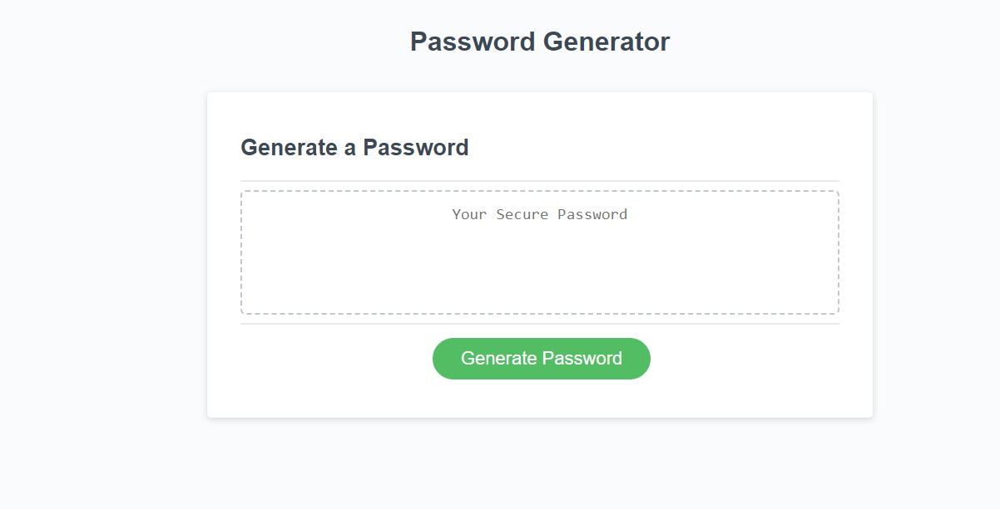

TITLE:

Password Generator with strong password criteria

DESCRIPTION:

The purpose of this challenge is to create a password generator with strong security features for an employer who has access to sensitive data.

ACCEPTANCE CRITERIA:

Create a prompt when the user clicks on the button to generate a password
The user is able to complete the promptsfor password criteria
One of the prompts asks the user to select the length of the password of at least 8 characters and no more than 128 characters
The user is also able to pick whether or not to use lowercase, uppercase, numeric, and/or special characters
Each prompt is validated after at least one character type is selected
After answering all prompts, the password is then generated
The password is either displayed in an alert or written to the page

TASKS COMPLETED:

-Modified the code to include necessary variables, functions, and conditional statements.

CREDITS:

While this job was peformed with care by yours truly, I cannot let the assistance of my classmates, AI, learning assistants, TAs, and professor go unnoticed.

I look forward to your feedback. Be brutal.

LICENSE:

@oneday

BADGES & GADGETS:

TBD

FEATURES: 

Lots of Ctrl Z

TESTS:

My patience and my sanity   

LINK:

 https://katvela24.github.io/passwordgenerator/

SCREENSHOT:

 